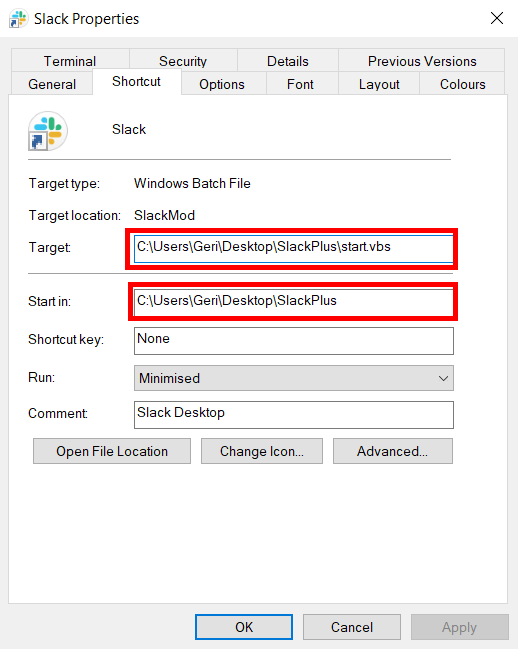

# SlackPlus
This is a super simple script to inject JavaScript code into [Slack](https://slack.com/) allowing limitless client-side customization.

This works by starting Slack with Electron's `--remote-debugging-port=` startup flag which lets us pass and execute data in Slack using websockets. 

---

## 🛠 Setup
⚠️**WARNING**: This currently only works on Windows, but should be as simple as refactoring the `Utils#getSlackLocation` method to find Slack on Linux/macOS.  

1. Make sure you have [Node.js](https://nodejs.org/en/download) 16+ installed. (You can verify with `node -v` a terminal)
2. Open a good permanent place for the script, and clone the project (`git clone git@github.com:NotGeri/SlackPlus.git`) or here on GitHub, click 'Code' ➜ 'Download ZIP' and unzip it.
3. Install the dependencies (`npm i`)
4. Open where you have your Slack shortcut (By default, you can press Windows key + R and enter: `%appdata%\Microsoft\Windows\Start Menu\Programs\Slack Technologies Inc`)
5. Right-click the shortcut ➜ 'Properties' ➜ 'Shortcut'
6. Set 'Target' as the `start.vbs` script in the project's directory. This simply executes the script without the terminal being visible.
7. Set 'Start in' to be the project's directory.
8. Click 'Apply' and start your Slack.

---

## ⚙ Usage
To inject your JavaScript files, you can make a new file ending in `.js` in the `custom/` directory. 

The app will automatically attempt to inject it whenever you start Slack using the method mentioned in the [setup steps](#-setup).

You can see a very basic example in [custom/example.js](custom/example.js)

Keep in mind the DOM may not yet be available when the script is injected.